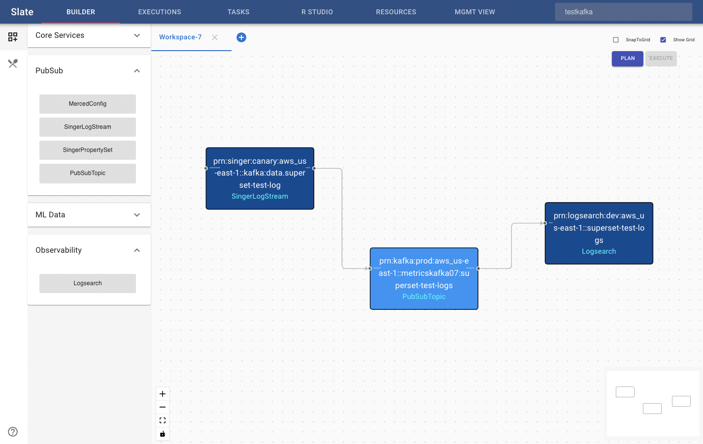
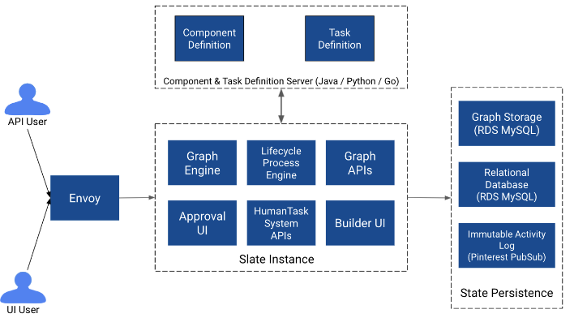
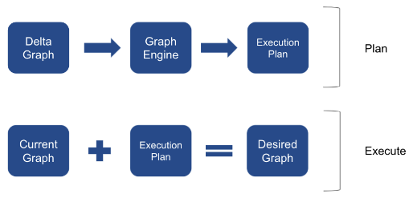

# Design

### Features

**State based change execution**

The system should check the current state and apply only the necessary delta based on the requested change.

**Dependency management / awareness for a change**

The system needs to support the correct order of operations resulting from an original change request e.g. if an update to capacity of a resource is performed, is there sufficient capacity upstream and downstream?

**Connectivity graph to make edges intuitive and smart**

Each resource (vertex) should define the allowed / required input and output edges making it easy for users to understand what is and isn’t a valid connection e.g. connecting kafka topic vertex to a REST api endpoint makes no sense. This pattern can ensure that the system can automatically analyze when the minimum number of inputs and outputs are not met, providing extensive validation and preventing incorrect provisioning requests. E.g. Trying to provision a singer logstream without having an existing PubSub topic would lead to runtime failures and can trigger performance impact on critical fleets.

**Business process management to track and support manual tasks**
Creating, updating and deleting Resources are not always available via API calls e.g. adding ACLs to a Kafka topic require explicit approvals from multiple teams. These process flows are deterministic but have several cases depending on the context and the user inputs. These processes are critical to be enforced in case of compliance and in other cases require extensive documentation and education for users which is not guaranteed therefore the system should track these tasks allowing human and automation steps to be mingled together to accomplish the user goal. The process definitions should be decision trees or state machines that can allow the Resource owners to handle the corner cases.

One common scenario is conditional logic for provisioning depending on user input e.g. kafka topic that requires higher level of consistency.

**Pluggable resource definitions (aka Providers)**

Given that there are several platform teams at Pinterest it is natural to ensure that this system provides a team owning a Resource in the real world to also own the logic of how that Resource’s lifecycle is managed (Resource Definition) e.g. Logging team owns PubSub / Singer / Merced, Query Platform team owns Hive Tables etc.

**Visual construction of application topology**

Not all users are looking for programmatic access to building applications, therefore the system should support a visual builder for these application topologies.

**Recipes / templates for common application topologies**

The system should also support the ability to define recipes to make it easier for customers to materialize common patterns e.g. batch ingestion / analytics

### Internals

Slate is an enhanced version of the infrastructure-as-code-system that is capable of maintaining the shared topology / graph of Resources used to build applications at Pinterest applied to Data Infrastructure. It provides:
Graph Engine for detecting delta and performing cascading change calculations to decide what needs to be provisioned and how
Interface for creating new Resource Definitions
Process management for handling tasks
Library of common tasks that can be used to create new processes

Resources in are modeled after “Functions” in programming languages i.e. X number of inputs and Y number of outputs where X and Y can range from 0 to 100s (in reality they would be single digit input and output). Modeling resources this way enables engineers to find the system intuitive and also satisfies the various types of resources and resource behaviors e.g. joins, merge, fan out, fan in etc.

The Graph Engine takes a delta graph (added, updated or deleted resources including connections) as input from the user and generates the Execution Plan Graph which is sent to the Runtime for execution. Once execution has been successfully completed the Current Graph should achieve the desired state. The Graph Engine generates this Execution Plan by triggering the planUpdate method for each of the Resources in the resolved delta graph.

Execution Plan is a graph of Processes which, if executed, will result in the current Resource Graph to transition to the desired Graph.

**Basics**

The system uses certain basic principles which are incorporated in various aspects of the system:

1. JSON types are used for storing any serializable data to allow easy translation when using in various polyglot environments. All states in the system are stored as JSON.

2. Edges are managed as input and output resources instead of generic edges since the ordinal value of a connection matters due to the function signature-like design of resources.

**Entities**

The system contains the following core entities:

- Resource
- ResourceDefinition
- GraphEngine
- Plan
- LifecycleProcess
- TaskNode
- TaskDefinition

*Resource*
Resource in the system is equivalent to a vertex of the application topology graph which may be connected to other Resources via inputs or outputs. A Resource object is used to r preserve the desired state of it’s real world counterpart in the Graph (current state is retrieved for a resource before the plan method is triggered). Each Resource must have a definition class which defines what type of Resource it is e.g. kafka topic, singer logstream etc. The table below describes how the various fields of Resource are used.

*ResourceDefinition*
Each Resource must have a type e.g. kafka topic, singer logstream etc. This is very similar to Class definition in programming languages, where the type of an object (the Class) is stored separately from an object instance. The other difference here is that ResourceDefinition is what contains the methods / capabilities of a given resource. The reason for this is to allow serialization of state without requiring serialization of logic which enables Polyglot (implementations in multiple languages) operations for planning.
A ResourceDefinition is expected to provide the following:
1. Plan for any proposed changes on the Resource
2. Read external current state of the Resource
3. Schemas
    - UI Schema
    - Config Schema
    - Edge schema (required inbound and outbound edge / connection types (constraints))

The above info is used by the graph engine to perform validation and planning. 

ResourceDefinition is an interface that defines the required methods necessary for a definition to be used by the system.

Different ResourceDefinitions are specified in the system and loaded in memory at startup, these ResourceDefinitions are instantiated once per instance of Slate and invoked by the GraphEngine when changes are triggered. 

*Plan*
A Plan is made of two parts:
1. LifecycleProcess
2. Upstream resource dependencies (resource ids of upstream dependencies for this change)

*Lifecycle Process / Lifecycle Process Engine*
Resource lifecycle is managed using processes in the real world; e.g. new provisioning may require capacity allocation, updates may require chain of approvals etc. These processes can be broken down into tasks and conditions e.g. if this task succeeds then proceed to next else use another approach. Note that there are two levels of abstractions / controls in the system for Processes generated by Resources:
1. Resource generated/controlled Process definition
2. Process level decision making
This means ResourceDefinition owners can either customize the definition of the process dynamically or they can build logic for handling various scenarios within a given Process definition.

*TaskDefinition [polyglot capable]*
TaskDefinition is the logic / code to execute a task. TaskDefinitions are referenced in Tasks of one or more LifecycleProcesses. They should be designed to be reusable so multiple LifecycleProcess definitions can use them. 

*Task*
Task is a container for a serializable Task state and is used for actually defining a LifecycleProcess. A Task defines:
what is going to be done (i.e. what TaskDefinition is being used)
how the outcome status will be handled (what will happen when a task succeeds vs fails)

Note: that in the prototype implementation, we have not implemented Task timeouts; however that will be added based on user feedback and analysis of real requests.

*Graph Engine*
The Graph Engine is responsible for maintaining the graph of all Resources including planning graph updates and orchestrating the execution of these updates.

The Graph Engine maintains the Resource Graph in the form of a map of Resources indexed by their id (input and output resourceIds). This graph can be stored in an external store like AWS Neptune or a key value store like DynamoDB, for the initial version we are going to store this in a relational database.
